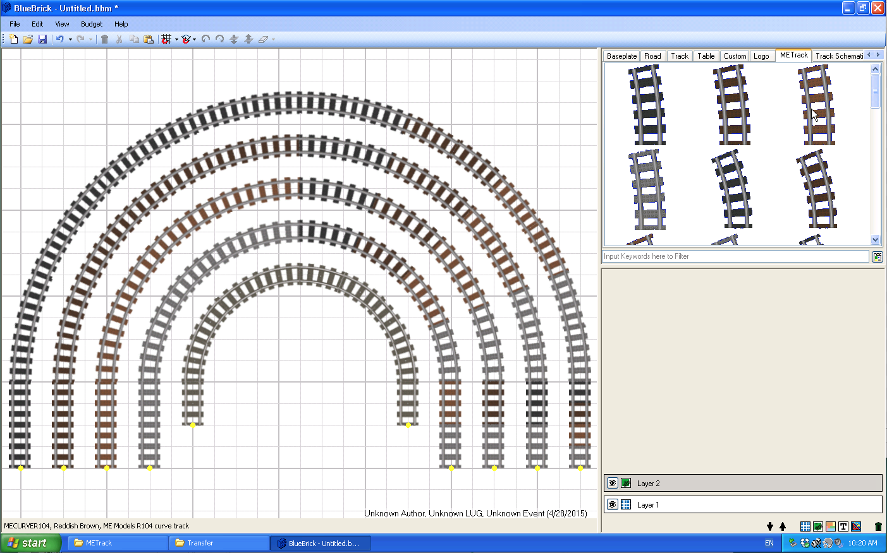
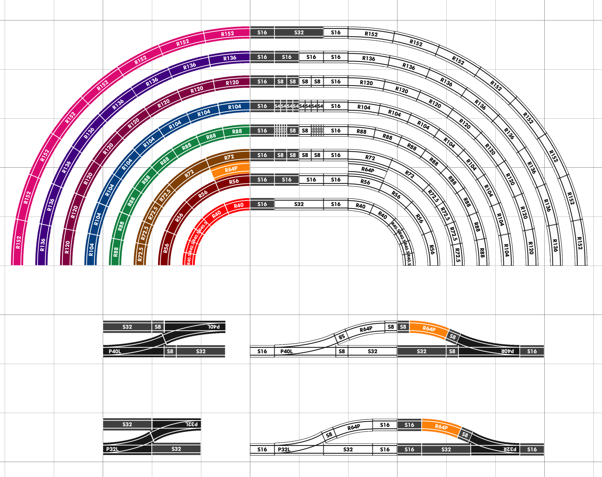
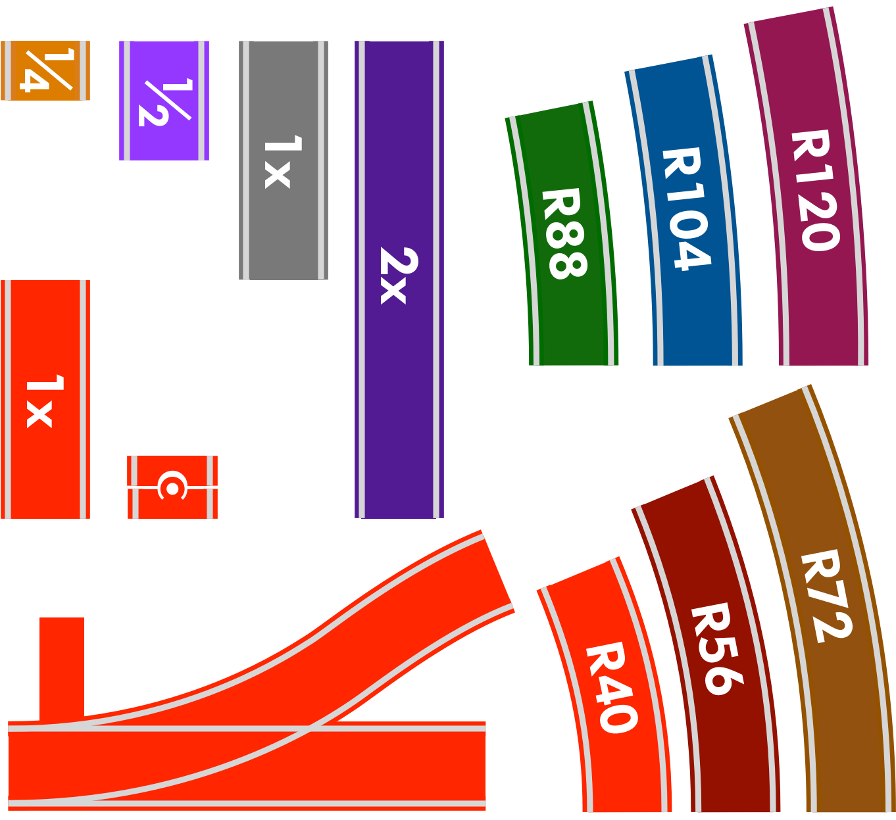
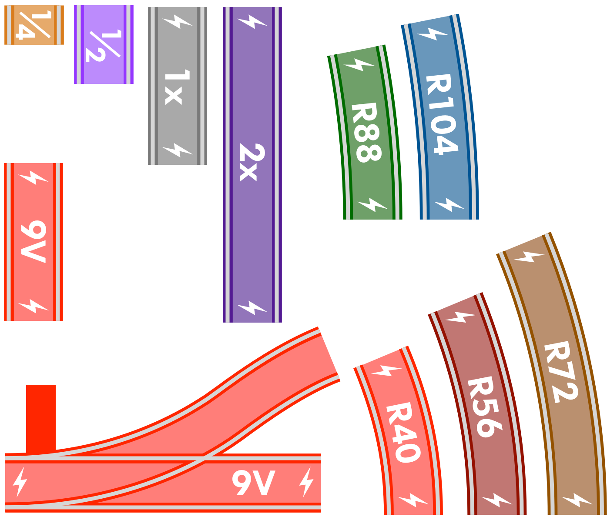
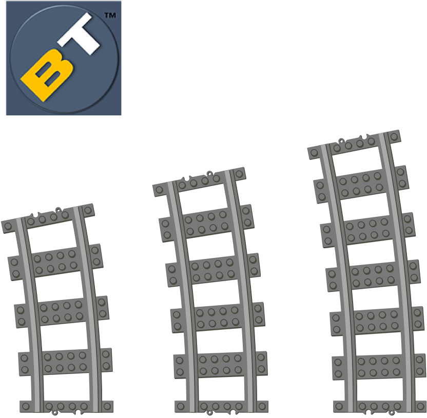
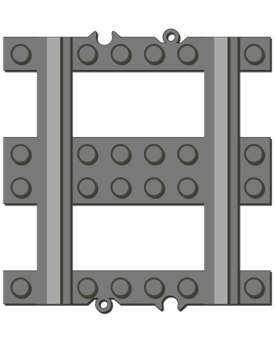
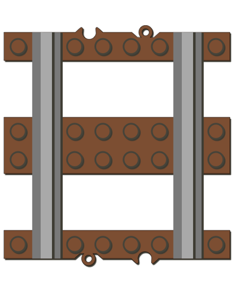
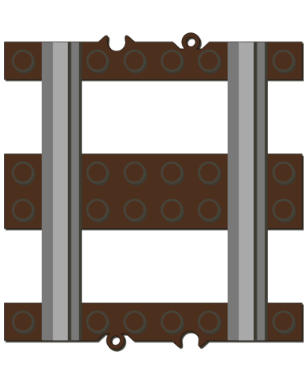
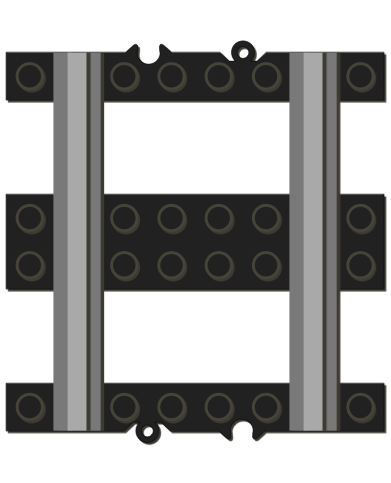

# L-Gauge.org BlueBrick Libraries

This repository contains add-on part libraries for the BlueBrick layout design tool. <a href="http://bluebrick.lswproject.com">BlueBrick</a> (by Alban Nanty) is an excellent open source software tool for designing Lego® based layouts. This tool allows you to arrange baseplates, track, and other items into any desired layout configuration. You can assign different drawing layers for each item, generate parts lists, add text annotations, and much more. BlueBrick comes pre-installed with many different parts libraries, including Lego® track from the 4.5V era up to current 9V/RC track. Since the introduction of new alternative track items from ME Models, BrickTracks, etc. we can now build layouts with new curve radii options of 56, 72, 88, and 104 studs. Below, you can download additional component libraries to expand the possibilities of layout design using BlueBrick.

## Library Format

BlueBrick part libraries consist of a file folder containing part definition files.  Each part in a library is defined by two files:

1. **GIF Image** - a pixel image of the part with a scale of 1 pixel per millimetre (mm).  The part should be nominally centred within the image file.
2. **XML Specification** - an XML file specifies meta data for the part including its description, author, etc. It also specifies connection points to other adjacent elements of the same type (e.g. for track, roads, etc.).  Connection points are specified relative to the centre of the part GIF image file, i.e. the origin is the centre. Connection coordinates are specified with X,Y pairs with the Y axis "flipped", i.e. -Y is up and +Y is down, in units of *studs* (not mm).

The filenaming convention for a part is:

```
<partname>.<color>.gif
<partname>.<color>.xml
```

where `partname` is the name you assign to the part and `color` is the LDraw color code decimal value (optional) for the part.

An example of a part is shown for standard 16-stud straight track element in dark bluish gray (LDraw color code `72`):

#### Image File: RCStdStraight.72.gif


#### XML File: RCStdStraight.72.xml

```
<?xml version="1.0" encoding="UTF-8"?>
<part>
	<Author>Michael Gale (brick dimensions)</Author>
	<Description>
		<en>Full straight, plastic rail</en>
	</Description>
  <SortingKey>RC-2</SortingKey>
	<!-- The margin of this part in stud for snaping on the grid, relative to the bitmap -->
	<SnapMargin>
		<left>0.0</left>
		<right>0.0</right>
		<top>0.5</top>
		<bottom>0.5</bottom>
	</SnapMargin>
	<!-- list of connexion point (assuming that this part can connect to another one), the position of the connexion is in stud coord and relative to the origine defined above) -->
	<ConnexionList>
		<connexion>
			<!-- type of connexion (0=none, 1=rail, 2=road, 3=monorail standard, 4=monorail short curve) -->
			<type>1</type>
			<position>
				<x>0</x>
				<y>-8</y>
			</position>
			<angle>-90</angle>
			<angleToPrev>180.0</angleToPrev> <!-- how much angle between this connection and the prev one in this circular list -->
			<angleToNext>180.0</angleToNext> <!-- how much angle between this connection and the next one in this circular list -->
			<nextConnexionPreference>1</nextConnexionPreference> <!-- index (0-based) in that list for connecting the next part -->
			<electricPlug>1</electricPlug>
		</connexion>
		<connexion>
			<!-- type of connexion (0=none, 1=rail, 2=road, 3=monorail standard, 4=monorail short curve) -->
			<type>1</type>
			<position>
				<x>0</x>
				<y>8</y>
			</position>
			<angle>90</angle>
			<angleToPrev>180.0</angleToPrev> <!-- how much angle between this connection and the prev one in this circular list -->
			<angleToNext>180.0</angleToNext> <!-- how much angle between this connection and the next one in this circular list -->
			<nextConnexionPreference>0</nextConnexionPreference> <!-- index (0-based) in that list for connecting the next part -->
			<electricPlug>-1</electricPlug>
		</connexion>
	</ConnexionList>
</part>
```

For more details on defining custom parts, consult the <a href="http://bluebrick.lswproject.com">documentation on the BlueBrick website</a>.

## Libraries

### L-Gauge Schematic



This library represents generic L-Gauge compatible track in schematic form.  It is not vendor specific and is representative of elements available from LEGO®, BrickTracks, Fx Bricks, etc.

The library comes in both color and monochrome versions to give more stylistic choices for making track plan documents.

### Schematic (RC/Plastic Track)



This library exclusively contains plastic track components illustrated as symbols so that you can create track schematic drawings. This library has the following features:

* Universal: includes plastic track elements from LEGO®, ME Models, BrickTracks, and other vendors
* Colour Coded: elements are colour coded for easy identification. Red elements represent track products from LEGO®, orange elements are custom parts, and components have different colours for each unique curve radius.
* Custom Elements: a range of customized track elements are included such as single element stub switches and compound track arrangements such as pre-made/aligned crossovers (LH/RH)
* Complete: all track elements are properly identified by colour and part number (where applicable). This will be especially helpful when generating a parts list since it will itemize all unique parts.

It is recommended to install this library into a new sub-folder of the BlueBrick `..\parts\` folder. To install and use this library:

Make a new subfolder under the BlueBrick library folder, e.g. `..\BlueBrick 1.8.0\parts\Schematic RC`
Copy and unzip the `SchematicRC.zip` file into the new sub-folder
Launch BlueBrick and verify that the new track components are contained in a new category with the same name as the sub-folder you created, e.g. "Schematic RC"

### 9V (Metal) Track



This library exclusively contains metal/9V track components illustrated as symbols so that you can create track schematic drawings.

### BricksTracks Track (Dark Bluish Gray)



BlueBrick library which includes the BrickTracks R56, R72, R88, R104, and R120 curves.

### ME Models Track (Dark Bluish Gray)



BlueBrick library which includes the ME Models R56, R72, R88, and R104 curves as well as the half, standard, and double length straights. This library only includes track elements illustrated in dark bluish gray.

### ME Models Track (Reddish Brown)



ME Models track elements illustrated in reddish brown.

### ME Models Track (Dark Brown)



ME Models track elements illustrated in dark brown.

### ME Models Track (Black)



ME Models track elements illustrated in black.


## Links

<li><a href="http://l-gauge.org/">L-Gauge.org</a></li>
<li><a href="http://bluebrick.lswproject.com">BlueBrick layout editor</a></li>

---
<p><small>LEGO® is a trademark of the LEGO® Group of companies which does not sponsor, authorize or endorse this site.</small></p>
